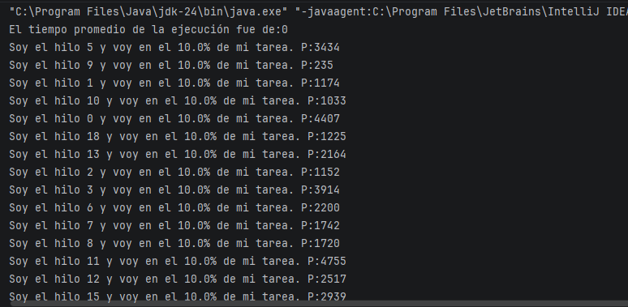
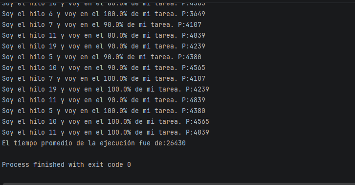
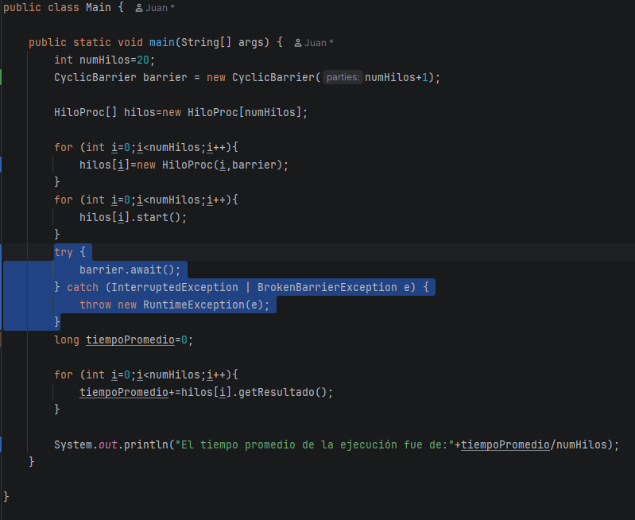
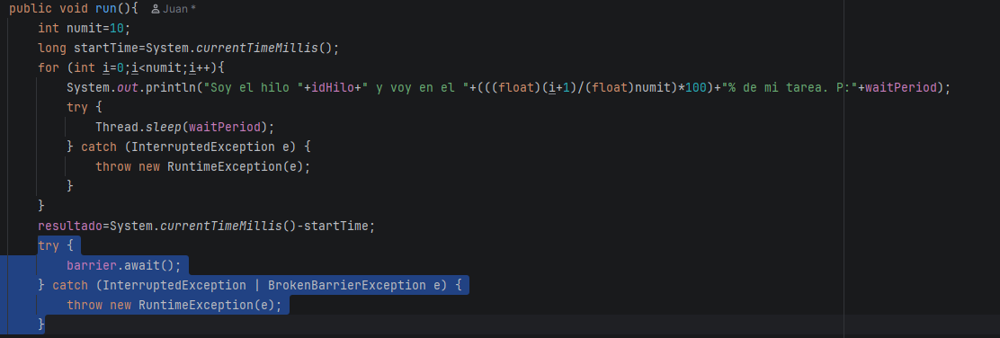

# Synchronization Workshop - Barrier Synchronization Pattern

In this lab, a program is provided that creates N threads. Each thread performs the same task at a different speed, and at the end, the program calculates the average execution time of all the threads.

## Initial Problem

In the first version of the program, when it is executed, 20 threads are created. These threads start performing their tasks and report their progress in different orders depending on their execution speed.

However, before the messages from the running threads are displayed, the following message appears first:

"El tiempo promedio de ejecución fue de: 0"

This is incorrect because this message should be displayed at the end of the whole process, after all the threads have finished. Naturally, the result should be greater than 0.

This shows that the calculation of the total execution time is not being controlled correctly, since there is nothing that pauses the execution of the main thread while the rest of the threads finish their tasks.

## Solution

To solve this problem, the barrier synchronization strategy was used. For this, an instance of Java's `CyclicBarrier` class is created with the number of threads that will be created plus one, in order to include the main thread as well.

Then, this `CyclicBarrier` object is passed through the constructor to all the threads, and each thread stores it as an attribute.

Inside the `run` method of each thread, after calculating the total execution time, the thread calls the barrier using the `await` method.

Inside the `main` method, the `await` method of the barrier is also called after calling the `start` method on all the threads.

In this way, when each thread finishes its execution, it notifies the barrier. When the 20 worker threads have finished and the main thread also calls the `await` method, the rest of the code continues executing.

In the case of the worker threads, they do not have anything else to do, so they finish their execution. In the case of the main thread, it continues with the calculation of the average execution time.

